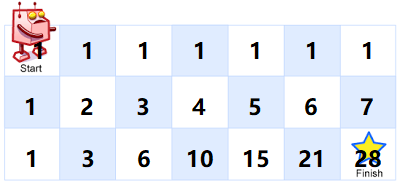

原题链接：[https://leetcode-cn.com/problems/unique-paths/description/](https://leetcode-cn.com/problems/unique-paths/description/)

## 题目
一个机器人位于一个 m x n 网格的左上角 （起始点在下图中标记为“Start” ）。

 机器人每次只能向下或者向右移动一步。机器人试图达到网格的右下角（在下图中标记为“Finish”）。

 问总共有多少条不同的路径？


 例如，上图是一个7 x 3 的网格。有多少可能的路径？

 说明：m 和 n 的值均不超过 100。

 示例 1:

 输入: m = 3, n = 2

 输出: 3

 解释:

 从左上角开始，总共有 3 条路径可以到达右下角。

 1\. 向右 -> 向右 -> 向下

 2\. 向右 -> 向下 -> 向右

 3\. 向下 -> 向右 -> 向右


 示例 2:

 输入: m = 7, n = 3

 输出: 28

## 解释
该题目为`动态规划`类型，用坐标(m,n)代表终点那一格，格子上的步数代表可到达终点的步数，逐步往下推，可得到：  


可得出 动态规划公式：`N(m,n) = N(m-1,n)+N(m,n-1)`，即可到达第（m，n）格的路径数等于可到达第（m-1,n）格与第（m,n-1）格的路径数之和。

## Code

```java
class Solution {
    public int uniquePaths(int m, int n) {
        //N(m,n) = N(m-1,n)+N(m,n-1)
        int path[][] = new int[m][n];
        for(int i = 0;i<m;i++){
            for(int j = 0;j<n;j++){
                if(i == 0 || j == 0){
                    path[i][j] = 1;
                }else{
                    path[i][j] = path[i-1][j]+path[i][j-1];
                }

            }
        }

        return path[m-1][n-1];
    }
}
```

