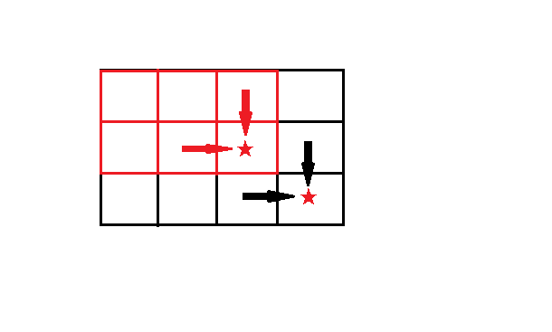

原题链接：[https://leetcode-cn.com/problems/minimum-path-sum/description/](https://leetcode-cn.com/problems/minimum-path-sum/description/)
## 题目

[64] 最小路径和

 给定一个包含非负整数的 m x n 网格，请找出一条从左上角到右下角的路径，使得路径上的数字总和为最小。

 说明：每次只能向下或者向右移动一步。

 示例:

 输入:

 [

 [1,3,1],

 ⁠ [1,5,1],

 ⁠ [4,2,1]

 ]

 输出: 7

 解释: 因为路径 1→3→1→1→1 的总和最小。

## 思路

这道题对于064来说，难度小了不少，唯一需要考虑的就是动态规划的公式如何定，由于题目限定只能向下或者向右走，所以通向终点的只有两条路径，如下图：

所以只需比较到达 (m,n-1) 与 (m,n-1) 两个格子的最短路径，即：
`Length(m,n) = Min( Length(m,n-1),Length(m,n-1) )+L(m,n)`  

## Code

```java
class Solution {
    //L(m,n) = Min(L(m,n-1),L(m-1,n))
    public int minPathSum(int[][] grid) {
        int m = grid.length;
        int n = grid[0].length;
        int[][] length = new int[m][n];
        for(int i = 0;i<m;i++){
            if(i == 0){
                length[i][0] = grid[i][0];
            }else{
                length[i][0] = length[i-1][0]+grid[i][0];
            }
            for(int j = 1;j<n;j++){
                if(i == 0){
                    length[0][j] = length[0][j-1] + grid[0][j];
                }else{
                    length[i][j] = Math.min(length[i][j-1],length[i-1][j])+grid[i][j];
                }
            }
        }
        return length[m-1][n-1];
    }
}
```


